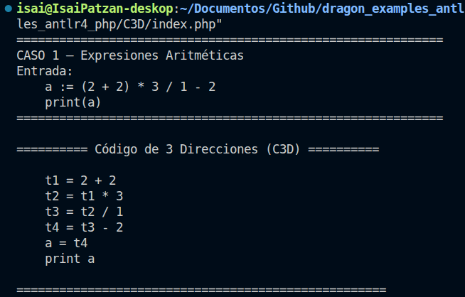
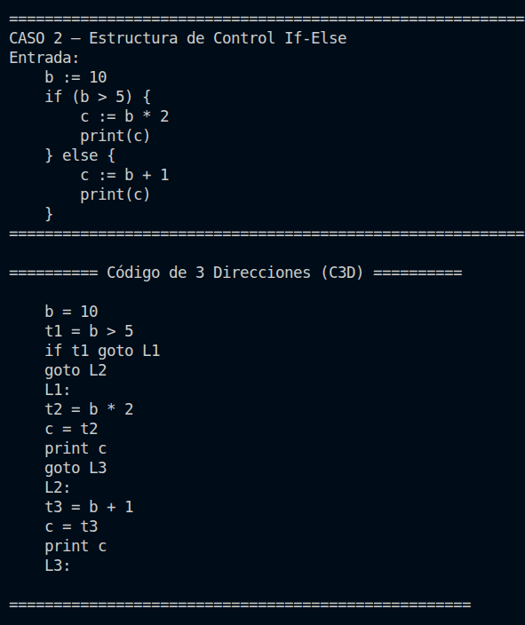
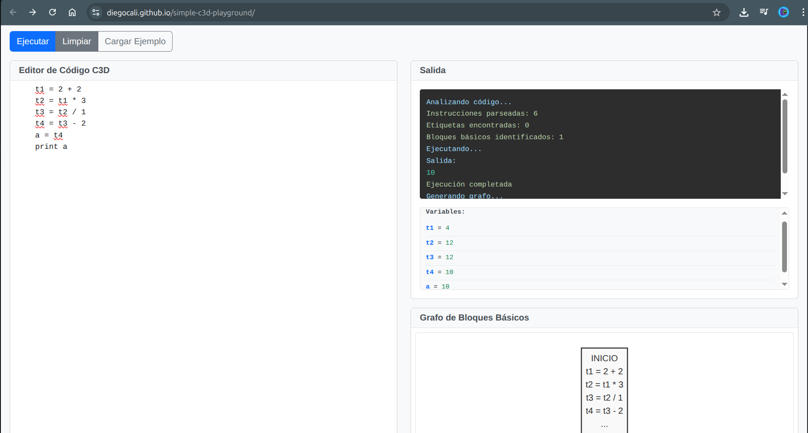
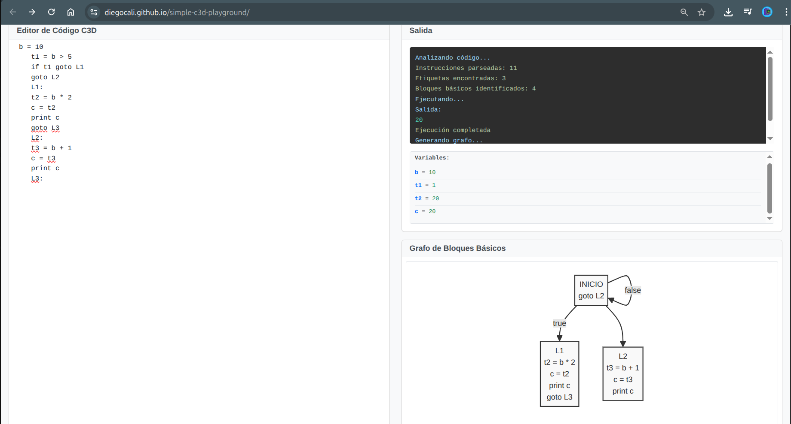

# [OLC2] Tarea 2 – Código de 3 Direcciones con ANTLRv4

**Universidad San Carlos de Guatemala**  
**Facultad de Ingeniería – Ingeniería en Ciencias y Sistemas**  
**Organización de Lenguajes y Compiladores 2 – 1er Semestre 2026**
**Ebed Isai Patzan Tzic  ---    202308204**

---

## Estructura del Proyecto

```
tarea2/
├── Grammar.g4          ← Gramática ANTLR4
├── C3DGenerator.php    ← Clase para manejar temporales, etiquetas e 
├── GrammarVisitor.php  ← Visitor que recorre el árbol y genera el C3D
└── index.php            ← Punto de entrada / pruebas
```

---

## Parte 1 – Expresiones Aritméticas

### Gramática ANTLR4 (`Grammar.g4`)

```antlr
grammar Grammar;

program
    : statement+ EOF
    ;

statement
    : assignment SEMICOLON?     # AssignStmt
    | printStmt  SEMICOLON?     # PrintStmt
    | ifStmt                    # IfStmtRule
    ;

assignment : ID ASSIGN expr ;
printStmt  : PRINT LPAREN ID RPAREN ;

ifStmt
    : IF LPAREN condition RPAREN
        LBRACE statement+ RBRACE
      ( ELSE LBRACE statement+ RBRACE )?
    ;

condition : expr relOp expr ;
relOp     : GT | LT | GEQ | LEQ | EQ | NEQ ;

// Precedencia: MulDiv > AddSub (alternativa más arriba = mayor precedencia)
expr
    : expr op=(MUL | DIV) expr  # MulDivExpr
    | expr op=(ADD | SUB) expr  # AddSubExpr
    | LPAREN expr RPAREN        # ParenExpr
    | NUMBER                    # NumberExpr
    | ID                        # IdExpr
    ;

// Tokens
IF:'if'; ELSE:'else'; PRINT:'print';
ADD:'+'; SUB:'-'; MUL:'*'; DIV:'/';
GEQ:'>='; LEQ:'<='; GT:'>'; LT:'<'; EQ:'=='; NEQ:'!=';
ASSIGN:':=';
LPAREN:'('; RPAREN:')'; LBRACE:'{'; RBRACE:'}'; SEMICOLON:';';
NUMBER : [0-9]+ ('.' [0-9]+)? ;
ID     : [a-zA-Z_][a-zA-Z_0-9]* ;
WS     : [ \t\r\n]+ -> skip ;
```

---

### Clase `C3DGenerator.php`

Gestiona el estado global de la generación:

| Método | Descripción |
|---|---|
| `newTemp(): string` | Genera un nuevo temporal `t1, t2, t3 …` |
| `newLabel(): string` | Genera una nueva etiqueta `L1, L2, L3 …` |
| `emit(string $inst)` | Agrega una instrucción al listado C3D |
| `printC3D()` | Imprime todas las instrucciones generadas |

---

### Clase `GrammarVisitor.php`

Visitor que implementa un método `visit*` por cada regla etiquetada de la gramática:

| Método Visitor | Regla Grammar.g4 | Acción |
|---|---|---|
| `visitProgram` | `program` | Itera sobre todas las sentencias |
| `visitAssignment` | `AssignStmt` | Evalúa expr → emite `ID = tN` |
| `visitPrintStmt` | `PrintStmt` | Emite `print ID` |
| `visitIfStmt` | `IfStmtRule` | Genera etiquetas + saltos condicionales |
| `visitCondition` | `condition` | Emite `tN = left op right` + saltos |
| `visitExpr` | `MulDivExpr / AddSubExpr` | Emite `tN = op1 oper op2`, retorna `tN` |
| `visitExpr` | `ParenExpr` | Delega al `inner` sin instrucción extra |
| `visitExpr` | `NumberExpr / IdExpr` | Retorna el literal o nombre directamente |

---

### Entrada del Caso 1

```
a := (2 + 2) * 3 / 1 - 2
print(a)
```

### Árbol Sintáctico (AST) – Caso 1

```
program
└── AssignStmt  (a)
    └── AddSubExpr  (-)
        ├── MulDivExpr  (/)
        │   ├── MulDivExpr  (*)
        │   │   ├── ParenExpr
        │   │   │   └── AddSubExpr  (+)
        │   │   │       ├── NumberExpr  2
        │   │   │       └── NumberExpr  2
        │   │   └── NumberExpr  3
        │   └── NumberExpr  1
        └── NumberExpr  2
└── PrintStmt  (a)
```

### C3D Generado – Caso 1

El visitor genera las siguientes instrucciones en orden de recorrido post-orden:

```
t1 = 2 + 2
t2 = t1 * 3
t3 = t2 / 1
t4 = t3 - 2
a  = t4
print a
```

**Tabla de temporales:**

| Temporal | Operación | Valor calculado |
|---|---|---|
| `t1` | `2 + 2` | `4` |
| `t2` | `t1 * 3` | `12` |
| `t3` | `t2 / 1` | `12` |
| `t4` | `t3 - 2` | `10` |
| `a`  | `= t4` | `10` |

---

###  Captura 1 – Ejecución `php main.php` (Caso 1)



Ejecutar en terminal: `php main.php`

La captura muestra:
- El encabezado **"CASO 1 – Expresiones Aritméticas"**
- La entrada: `a := (2 + 2) * 3 / 1 - 2` y `print(a)`
- El bloque **"Código de 3 Direcciones (C3D)"** con las instrucciones
  `t1 = 2 + 2`, `t2 = t1 * 3`, `t3 = t2 / 1`, `t4 = t3 - 2`, `a = t4`, `print a`

---

## Parte 2 – Estructura de Control If-Else

### Entrada del Caso 2

```
b := 10
if (b > 5) {
    c := b * 2
    print(c)
} else {
    c := b + 1
    print(c)
}
```

### Árbol Sintáctico (AST) – Caso 2

```
program
├── AssignStmt  (b := 10)
│   └── NumberExpr  10
└── IfStmtRule
    ├── condition
    │   ├── IdExpr     b
    │   ├── relOp      >
    │   └── NumberExpr 5
    ├── trueStmts
    │   ├── AssignStmt  (c := b * 2)
    │   │   └── MulDivExpr (*)
    │   │       ├── IdExpr     b
    │   │       └── NumberExpr 2
    │   └── PrintStmt   (c)
    └── elseStmts
        ├── AssignStmt  (c := b + 1)
        │   └── AddSubExpr (+)
        │       ├── IdExpr     b
        │       └── NumberExpr 1
        └── PrintStmt   (c)
```

### C3D Generado – Caso 2

```
b  = 10
t1 = b > 5
if t1 goto L1
goto L2
L1:
    t2 = b * 2
    c  = t2
    print c
    goto L3
L2:
    t3 = b + 1
    c  = t3
    print c
L3:
```

**Tabla de etiquetas y saltos:**

| Símbolo | Tipo | Significado |
|---|---|---|
| `t1` | Temporal | Resultado de la condición `b > 5` |
| `L1` | Etiqueta | Inicio del bloque **verdadero** (if) |
| `L2` | Etiqueta | Inicio del bloque **falso** (else) |
| `L3` | Etiqueta | Punto de **reunión** después del if-else |
| `if t1 goto L1` | Salto cond. | Salta a L1 si la condición es verdadera |
| `goto L2` | Salto incond. | Cae al else si la condición es falsa |
| `goto L3` | Salto incond. | Sale del bloque true sin ejecutar el else |

---

###  Captura 2 – Ejecución `php main.php` (Caso 2)



La captura muestra:
- El encabezado **"CASO 2 – Estructura de Control If-Else"**
- La entrada con el `if-else`
- El C3D con: `b = 10`, `t1 = b > 5`, `if t1 goto L1`, `goto L2`,
  `L1:`, bloque verdadero, `goto L3`, `L2:`, bloque falso, `L3:`

---

## Parte 3 – Validación en el Playground

Playground utilizado: **https://diegocali.github.io/simple-c3d-playground/**

---

### Caso 1 – C3D ingresado en el Playground

```
t1 = 2 + 2
t2 = t1 * 3
t3 = t2 / 1
t4 = t3 - 2
a = t4
print a
```

###  Captura 3 – Playground Caso 1




### Caso 2 – C3D ingresado en el Playground

```
b = 10
t1 = b > 5
if t1 goto L1
goto L2
L1:
t2 = b * 2
c = t2
print c
goto L3
L2:
t3 = b + 1
c = t3
print c
L3:
```

###  Captura 4 – Playground Caso 2



La captura muestra:
- El C3D del if-else en el editor
- Los **4 bloques básicos**: INICIO, `L1`, `L2`, `L3`
- Las **ramas** del grafo de flujo: verdadero (→ L1) y falso (→ L2)
- Los **temporales**: `b = 10`, `t1 = 1`, `t2 = 20`, `t3 = 11` y las **etiquetas**: `L1`, `L2`, `L3`

---

