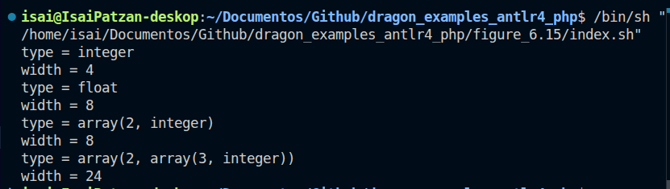

# Ejercicios PHP ANTLR 7 - ARM 5 - ARM 6

**Universidad / Curso:** Compiladores

**Tema:** Figura 6.15 - Atributos heredados y sintetizados con ANTLR4 en PHP

**Nombre:** Ebed Isai Patzan Tzic

**Fecha:** 17 de marzo de 2026

---

## 1. Grammar (`Grammar.g4`)

```g4
grammar Grammar;

t : b c EOF # T_rule;

b : INT     # B_int
  | FLOAT   # B_float
  ;

c : LBRACK NUMBER RBRACK c # C_array
  |                        # C_empty
  ;

INT     : 'int' ;
FLOAT   : 'float' ;
LBRACK  : '[' ;
RBRACK  : ']' ;
NUMBER  : [0-9]+ ;
WS      : [ \t\r\n]+ -> skip ;
```

## 2. Eval Visitor (`EvalVisitor.php`)

```php
<?php
// figure-6-15 > EvalVisitor.php

use Context\T_ruleContext;
use Context\B_intContext;
use Context\B_floatContext;
use Context\C_arrayContext;
use Context\C_emptyContext;

class EvalVisitor extends GrammarBaseListener
{
    private $inherited_type = '';
    private $inherited_width = 0;
    private $c_attrs = [];

    private function setCAttrs($ctx, array $attrs): void
    {
        $this->c_attrs[spl_object_id($ctx)] = $attrs;
    }

    private function getCAttrs($ctx): array
    {
        return $this->c_attrs[spl_object_id($ctx)] ?? ['type' => '', 'width' => 0];
    }

    public function exitT_rule(T_ruleContext $ctx): void
    {
        $_c_attrs = $this->getCAttrs($ctx->c());

        echo "type = " . $_c_attrs['type'] . "\nwidth = " . $_c_attrs['width'] . "\n";
    }

    public function exitB_int(B_intContext $ctx): void
    {
        $this->inherited_type = 'integer';
        $this->inherited_width = 4;
    }

    public function exitB_float(B_floatContext $ctx): void
    {
        $this->inherited_type = 'float';
        $this->inherited_width = 8;
    }

    public function exitC_array(C_arrayContext $ctx): void
    {
        $num_val = (int) $ctx->NUMBER()->getText();
        $_c1_attrs = $this->getCAttrs($ctx->c());

        $this->setCAttrs($ctx, [
            'type' => "array(" . $num_val . ", " . $_c1_attrs['type'] . ")",
            'width' => $num_val * $_c1_attrs['width']
        ]);
    }

    public function exitC_empty(C_emptyContext $ctx): void
    {
        $this->setCAttrs($ctx, [
            'type' => $this->inherited_type,
            'width' => $this->inherited_width
        ]);
    }
}
```

## 3. Script de ejecucion (`index.sh`)

```sh
#!/bin/sh

cd "$(dirname "$0")"

php index.php "int"

php index.php "float"

php index.php "int[2]"

php index.php "int[2][3]"
```

## 4. Punto de entrada (`index.php`)

```php
<?php
// figure-6-15 > index.php

require __DIR__ . '/../vendor/autoload.php';

require_once __DIR__ . '/GrammarLexer.php';
require_once __DIR__ . '/GrammarParser.php';
require_once __DIR__ . '/GrammarListener.php';
require_once __DIR__ . '/GrammarBaseListener.php';
require_once __DIR__ . '/EvalVisitor.php';

use Antlr\Antlr4\Runtime\InputStream;
use Antlr\Antlr4\Runtime\CommonTokenStream;
use Antlr\Antlr4\Runtime\Tree\ParseTreeWalker;

$input = $argv[1] ?? null;

if (!$input) {
    echo "Usage: php index.php \"code\"\n";
    exit(1);
}

$stream = InputStream::fromString($input);
$lexer = new GrammarLexer($stream);
$tokens = new CommonTokenStream($lexer);
$parser = new GrammarParser($tokens);

$tree = $parser->t();

$listener = new EvalVisitor();
$walker = new ParseTreeWalker();
$walker->walk($listener, $tree);
```

## 5. Resultado (evidencia)


