# Entregable - Figure 6.19, ARM 3 y ARM 4

## 1) Figure 6.19

### a) Archivo `Grammar.g4`
```antlr
grammar Grammar;

program: stat+ ;

stat: ID '=' expr NEWLINE          # assignment
    | NEWLINE                      # blank
    ;

expr: expr op=('*'|'/') expr       # MulDiv
    | expr op=('+'|'-') expr       # AddSub
    | INT                          # int
    | ID                           # id
    | '(' expr ')'                 # parents
    ;

ID  : [a-zA-Z]+ ;
INT : [0-9]+ ;
NEWLINE:'\r'? '\n' ;
WS  : [ \t]+ -> skip ;
```

### b) Archivo `Translator.php`
```php
<?php

class Attr {
    public ?string $AddrNUM = null;
    public ?string $AddrID = null;
    public ?string $Code = null;
}

class SymbolTable {
    private array $IDS = [];

    public function insert(string $name): void {
        $this->IDS[$name] = true;
    }

    public function exists(string $name): bool {
        return isset($this->IDS[$name]);
    }
}

class Translator extends GrammarBaseVisitor {
    public int $TID = 0;
    public string $Data = ".global _start\n\n.data\n";
    public string $Code = "\n.text\n_start:\n";

    private SymbolTable $symbolTable;

    public function __construct() {
        $this->symbolTable = new SymbolTable();
    }

    public function isNUM(Attr $attr): bool {
        return $attr->AddrNUM !== null && $attr->AddrID === null;
    }

    public function visitProgram(Context\ProgramContext $context) {
        foreach ($context->stat() as $statContext) {
            $this->visit($statContext);
        }

        $this->Code .= "\tmov X8, #93\n\tsvc #0\n";
        $attr = new Attr();
        $attr->Code = $this->Data . $this->Code;
        return $attr;
    }

    public function visitAssignment(Context\AssignmentContext $context) {
        $id = $context->ID()->getText();
        $expr = $this->visit($context->expr());

        if ($this->isNUM($expr)) {
            if ($this->symbolTable->exists($id)) {
                $this->Code .= "\tldr X0, =" . $id . "\n";
                $this->Code .= "\tmov X1, #" . $expr->AddrNUM . "\n";
                $this->Code .= "\tstr X1, [X0]\n\n";
            } else {
                $this->Data .= $id . ": .word " . $expr->AddrNUM . "\n";
                $this->symbolTable->insert($id);
            }
        } else {
            if ($this->symbolTable->exists($id)) {
                $this->Code .= "\tldr X0, =" . $id . "\n";
                $this->Code .= "\tldr X1, =" . $expr->AddrID . "\n";
                $this->Code .= "\tldr X2, [X1]\n";
                $this->Code .= "\tstr X2, [X0]\n\n";
            } else {
                $this->Data .= $id . ": .word 0\n";
                $this->Code .= "\tldr X0, =" . $id . "\n";
                $this->Code .= "\tldr X1, =" . $expr->AddrID . "\n";
                $this->Code .= "\tldr X2, [X1]\n";
                $this->Code .= "\tstr X2, [X0]\n\n";
                $this->symbolTable->insert($id);
            }
        }

        return new Attr();
    }

    public function visitAddSub(Context\AddSubContext $context) {
        $left = $this->visit($context->expr(0));
        $right = $this->visit($context->expr(1));

        $this->TID++;
        $addr = "t" . $this->TID;
        $this->Data .= $addr . ": .word 0\n";

        $this->Code .= "\tldr X0, =" . $addr . "\n";

        $opText = $context->op->getText();
        $op = ($opText === "+") ? "add" : "sub";

        if ($this->isNUM($left)) {
            if ($this->isNUM($right)) {
                $this->Code .= "\tmov X1, #" . $left->AddrNUM . "\n";
                $this->Code .= "\t" . $op . " X1, X1, #" . $right->AddrNUM . "\n";
                $this->Code .= "\tstr X1, [X0]\n";
            } else {
                $this->Code .= "\tmov X1, #" . $left->AddrNUM . "\n";
                $this->Code .= "\tldr X2, =" . $right->AddrID . "\n";
                $this->Code .= "\tldr X3, [X2]\n";
                $this->Code .= "\t" . $op . " X1, X1, X3\n";
                $this->Code .= "\tstr X1, [X0]\n";
            }
        } else {
            if ($this->isNUM($right)) {
                $this->Code .= "\tldr X1, =" . $left->AddrID . "\n";
                $this->Code .= "\tldr X1, [X1]\n";
                $this->Code .= "\t" . $op . " X1, X1, #" . $right->AddrNUM . "\n";
                $this->Code .= "\tstr X1, [X0]\n";
            } else {
                $this->Code .= "\tldr X1, =" . $left->AddrID . "\n";
                $this->Code .= "\tldr X2, [X1]\n";
                $this->Code .= "\tldr X3, =" . $right->AddrID . "\n";
                $this->Code .= "\tldr X4, [X3]\n";
                $this->Code .= "\t" . $op . " X2, X2, X4\n";
                $this->Code .= "\tstr X2, [X0]\n";
            }
        }

        $this->Code .= "\n";
        $attr = new Attr();
        $attr->AddrID = $addr;
        return $attr;
    }

    public function visitMulDiv(Context\MulDivContext $context) {
        $left = $this->visit($context->expr(0));
        $right = $this->visit($context->expr(1));

        $this->TID++;
        $addr = "t" . $this->TID;
        $this->Data .= $addr . ": .word 0\n";

        $this->Code .= "\tldr X0, =" . $addr . "\n";

        $opText = $context->op->getText();
        $op = ($opText === "*") ? "mul" : "sdiv";

        if ($this->isNUM($left)) {
            if ($this->isNUM($right)) {
                $this->Code .= "\tmov X1, #" . $left->AddrNUM . "\n";
                $this->Code .= "\tmov X2, #" . $right->AddrNUM . "\n";
                $this->Code .= "\t" . $op . " X1, X1, X2\n";
                $this->Code .= "\tstr X1, [X0]\n";
            } else {
                $this->Code .= "\tmov X1, #" . $left->AddrNUM . "\n";
                $this->Code .= "\tldr X2, =" . $right->AddrID . "\n";
                $this->Code .= "\tldr X3, [X2]\n";
                $this->Code .= "\t" . $op . " X1, X1, X3\n";
                $this->Code .= "\tstr X1, [X0]\n";
            }
        } else {
            if ($this->isNUM($right)) {
                $this->Code .= "\tldr X1, =" . $left->AddrID . "\n";
                $this->Code .= "\tldr X2, [X1]\n";
                $this->Code .= "\tmov X3, #" . $right->AddrNUM . "\n";
                $this->Code .= "\t" . $op . " X2, X2, X3\n";
                $this->Code .= "\tstr X2, [X0]\n";
            } else {
                $this->Code .= "\tldr X1, =" . $left->AddrID . "\n";
                $this->Code .= "\tldr X2, [X1]\n";
                $this->Code .= "\tldr X3, =" . $right->AddrID . "\n";
                $this->Code .= "\tldr X4, [X3]\n";
                $this->Code .= "\t" . $op . " X2, X2, X4\n";
                $this->Code .= "\tstr X2, [X0]\n";
            }
        }

        $this->Code .= "\n";
        $attr = new Attr();
        $attr->AddrID = $addr;
        return $attr;
    }

    public function visitParents(Context\ParentsContext $context) {
        return $this->visit($context->expr());
    }

    public function visitId(Context\IdContext $context) {
        $id = $context->ID()->getText();
        $attr = new Attr();
        $attr->AddrID = $id;
        return $attr;
    }

    public function visitInt(Context\IntContext $context) {
        $num = $context->INT()->getText();
        $attr = new Attr();
        $attr->AddrNUM = $num;
        return $attr;
    }
}
```

### c) Archivo `index.php`
```php
<?php

require __DIR__ . '/../vendor/autoload.php';

require_once __DIR__ . '/GrammarLexer.php';
require_once __DIR__ . '/GrammarParser.php';
require_once __DIR__ . '/GrammarVisitor.php';
require_once __DIR__ . '/GrammarBaseVisitor.php';
require_once __DIR__ . '/Translator.php';

use Antlr\Antlr4\Runtime\InputStream;
use Antlr\Antlr4\Runtime\CommonTokenStream;

$input = $argv[1] ?? null;

if (!$input) {
    echo "Usage: php index.php \"code\"\n";
    exit(1);
}

$stream = InputStream::fromString($input);
$lexer = new GrammarLexer($stream);
$tokens = new CommonTokenStream($lexer);
$parser = new GrammarParser($tokens);

$tree = $parser->program();

$visitor = new Translator();
$result = $visitor->visit($tree);

echo "ARM64 code:\n" . $result->Code . "\n";
```

### d) Archivo `index.sh`
```sh
#!/bin/sh

cd "$(dirname "$0")"

#php index.php "a = 1  b = 2 * a"

#php index.php "a = 1  b = 2  c = a + b * 2"

php index.php "a = 1  b = 2  c = a + b * 2  d = (c + 1) * 3"
```

### e) Salida generada (ARM64) al ejecutar `index.sh`

### f) Imagenes de resultados ARM

**f.1) Resultado ARM - parte 1**

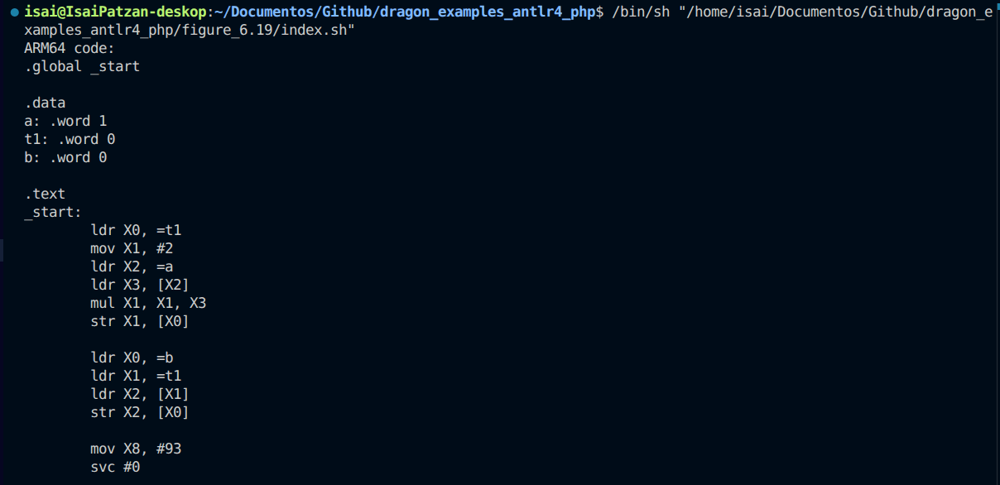

**f.2) Resultado ARM - parte 2**

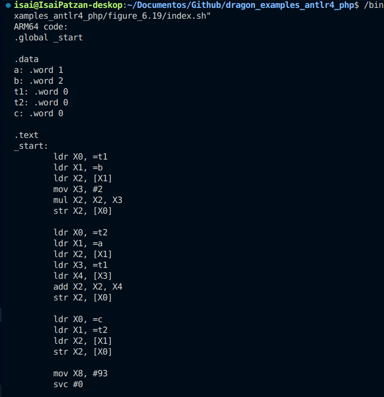

**f.3) Resultado ARM - parte 3**

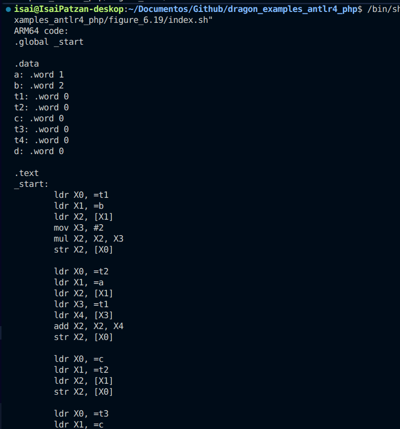
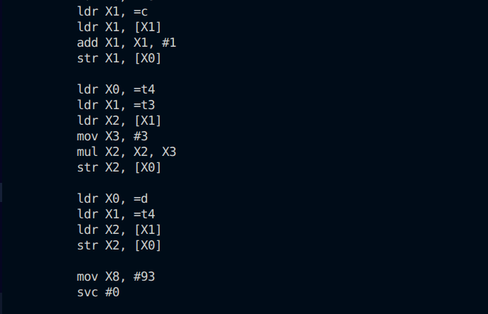

## 2) ARM 3 

**a) Configuracion de la Tarea 3**


**b) Ejercicio 1**

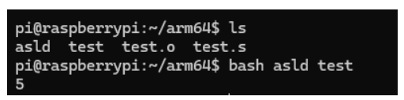

**c) Ejercicio 2**

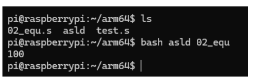

**d) Ejercicio 3**

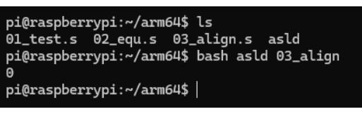

**e) Ejercicio 4**

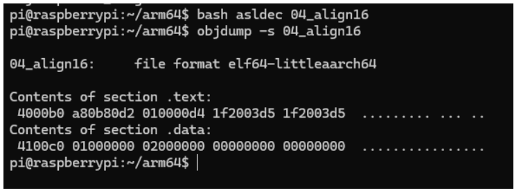

**f) Ejercicio 5**

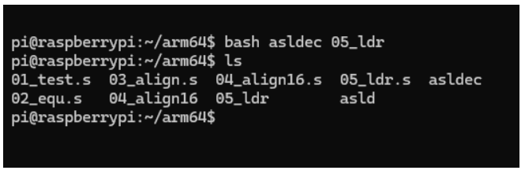

## 3) ARM 4 

**a) Ejercicio 1**

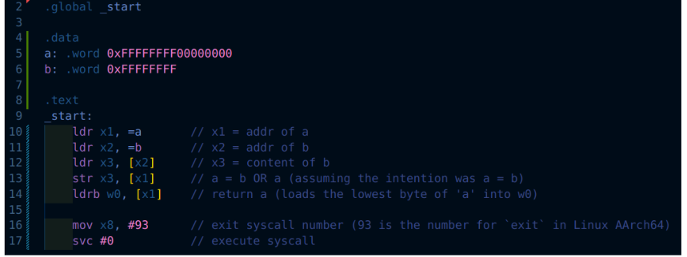

**b) Ejercicio 2**

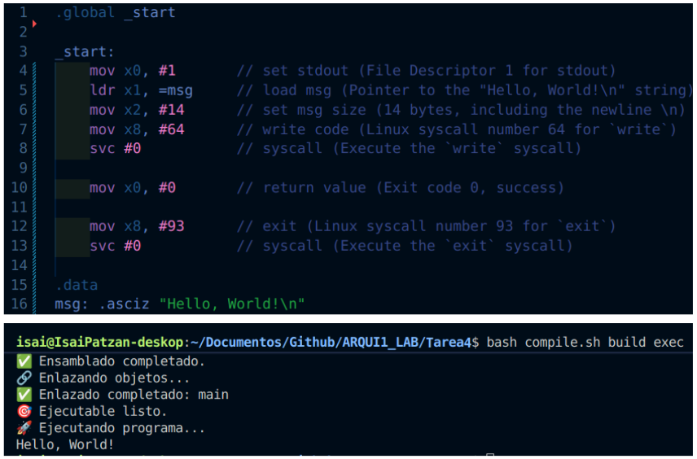

**c) Ejercicio 3**

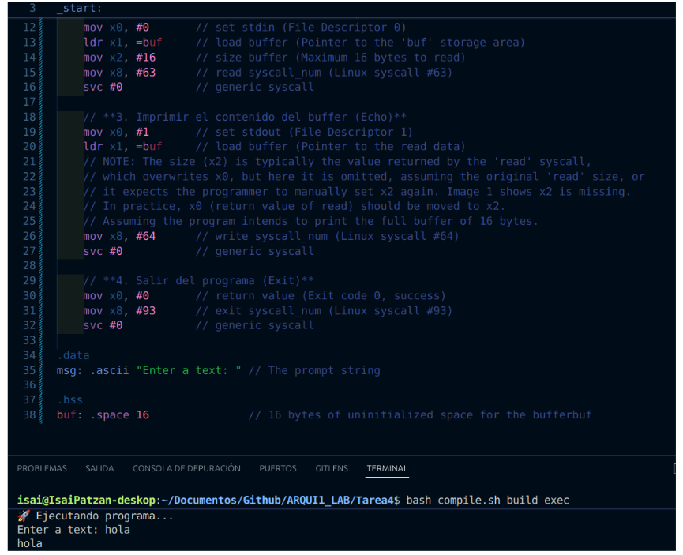

**d) Ejercicio 4**

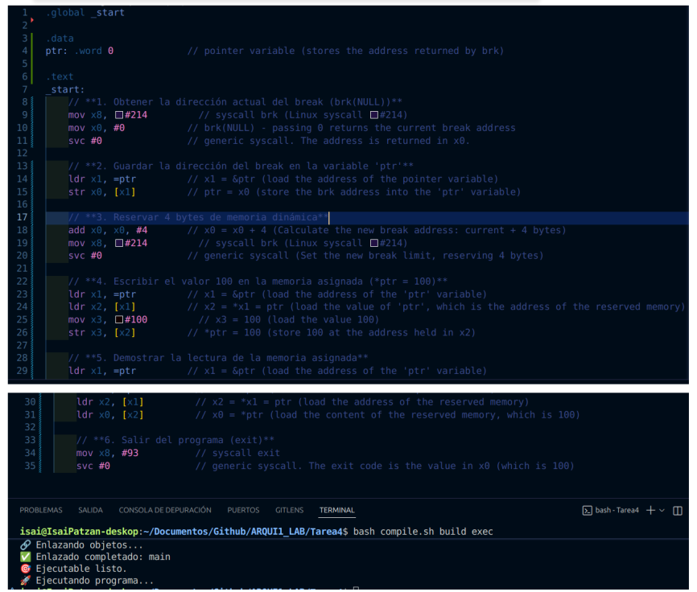

**e) Ejercicio 5**

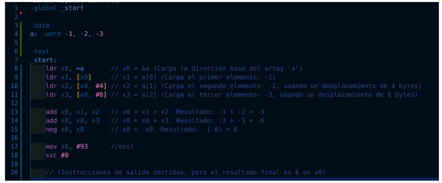
