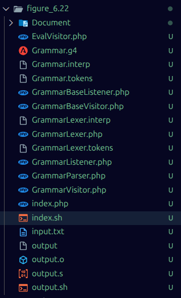
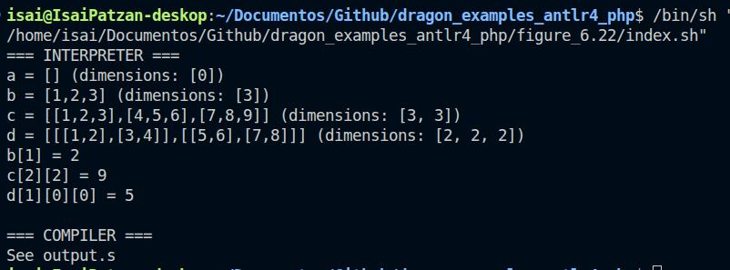
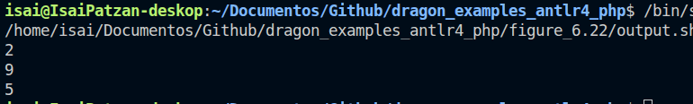

# Caratula

**Universidad de San Carlos de Guatemala (USAC)**  
**Estudiante:** Ebed Isai Patzan Tzic  
**Carne:** 202308204  
**Fecha:** 2 de abril de 2026

---

# Evidencia de Codificacion

## 1) Archivo `Grammar.g4`

Ruta: `figure_6.22/Grammar.g4`

```g4
grammar Grammar;

program
    : statement+ EOF
    ;

statement
    : ID '=' expression           # Assign
    | 'print' '(' ID indices ')'  # Print
    ;

indices
    : index+
    ;

index
    : '[' NUM ']'
    ;

expression
    : '[' ']'                  # EmptyList
    | '[' list_elements ']'    # ElementsList
    ;

list_elements
    : value (',' value)* # ValueList
    ;

value
    : NUM                      # ValueNum
    | expression               # ValueExpr
    ;

ID  : [a-zA-Z_][a-zA-Z0-9_]* ;
NUM : [0-9]+ ;
WS  : [ \t\r\n]+ -> skip ;
```

## 2) Archivo `EvalVisitor.php`

Ruta: `figure_6.22/EvalVisitor.php`

```php
<?php

use Context\ProgramContext;
use Context\AssignContext;
use Context\PrintContext;
use Context\IndicesContext;
use Context\IndexContext;
use Context\EmptyListContext;
use Context\ElementsListContext;
use Context\ValueListContext;
use Context\ValueNumContext;
use Context\ValueExprContext;

class EvalVisitor extends GrammarBaseVisitor
{
    public $data = ".data\n";
    public $text = ".text\n.global _start\n_start:\n";
    private $variables = [];

    private function get_dimensions($list)
    {
        if (is_array($list)) {
            if (empty($list)) {
                return [0];
            }
            $dims = $this->get_dimensions($list[0]);
            array_unshift($dims, count($list));
            return $dims;
        } else {
            return [];
        }
    }

    private function flatten_array($arr)
    {
        $result = [];
        array_walk_recursive($arr, function($a) use (&$result) {
            $result[] = $a;
        });
        return $result;
    }

    public function visitProgram($ctx)
    {
        $statements = $ctx->statement();
        if ($statements !== null) {
            foreach ($statements as $stmt) {
                $this->visit($stmt);
            }
        }
        
        // Finalizar programa
        $this->text .= "    \tmov x0, #0\n";
        $this->text .= "    \tmov x8, #93\n";
        $this->text .= "    \tsvc #0\n\n";

        // Funcion print_int (ITOA C fixed code)
        $this->text .= "print_int:\n";
        $this->text .= "    \tstr x30, [sp, #-48]!\n";
        $this->text .= "    \tmov x1, sp\n";
        $this->text .= "    \tadd x1, x1, #46\n";
        $this->text .= "    \tmov w2, #10\n";
        $this->text .= "    \tstrb w2, [x1]\n";
        $this->text .= "    \tmov x2, #10\n";
        $this->text .= "_L_itoa_check_zero:\n";
        $this->text .= "    \tcmp x0, #0\n";
        $this->text .= "    \tbge _L_itoa_loop\n";
        $this->text .= "    \tneg x0, x0\n";
        $this->text .= "_L_itoa_loop:\n";
        $this->text .= "    \tcbz x0, _L_itoa_sign\n";
        $this->text .= "    \tudiv x3, x0, x2\n";
        $this->text .= "    \tmsub x4, x3, x2, x0\n";
        $this->text .= "    \tadd x4, x4, #48\n";
        $this->text .= "    \tsub x1, x1, #1\n";
        $this->text .= "    \tstrb w4, [x1]\n";
        $this->text .= "    \tmov x0, x3\n";
        $this->text .= "    \tb _L_itoa_loop\n";
        $this->text .= "_L_itoa_sign:\n";
        $this->text .= "    \tldr x0, [sp, #48]\n";
        $this->text .= "    \tcmp x0, #0\n";
        $this->text .= "    \tbge _L_itoa_print\n";
        $this->text .= "    \tmov w2, #45\n";
        $this->text .= "    \tsub x1, x1, #1\n";
        $this->text .= "    \tstrb w2, [x1]\n";
        $this->text .= "_L_itoa_print:\n";
        $this->text .= "    \tmov x2, sp\n";
        $this->text .= "    \tadd x2, x2, #47\n";
        $this->text .= "    \tsub x2, x2, x1\n";
        $this->text .= "    \tmov x0, #1\n";
        $this->text .= "    \tmov x8, #64\n";
        $this->text .= "    \tsvc #0\n";
        $this->text .= "    \tldr x30, [sp], #48\n";
        $this->text .= "    \tret\n";

        return $this->data . "\n" . $this->text;
    }

    public function visitAssign($ctx)
    {
        $id = $ctx->ID()->getText();
        $expr = $this->visit($ctx->expression());

        $dimensions = $this->get_dimensions($expr);
        $dims_str = implode(', ', $dimensions);
        $expr_str = json_encode($expr); 

        fwrite(STDERR, "$id = $expr_str (dimensions: [$dims_str])\n");

        $this->variables[$id] = $expr;
        $value = $this->flatten_array($expr);

        $this->data .= "    $id: .word ";
        $nums = implode(', ', $value);
        if ($nums == "") {
            $this->data .= "0\n";
        } else {
            $this->data .= "$nums \n";
        }

        if (count($dimensions) == 1) {
            $this->data .= "    " . $id . "_cols: .word " . $dimensions[0] . "\n";
        } elseif (count($dimensions) == 2) {
            $this->data .= "    " . $id . "_rows: .word " . $dimensions[0] . "\n";
            $this->data .= "    " . $id . "_cols: .word " . $dimensions[1] . "\n";
        } elseif (count($dimensions) == 3) {
            $this->data .= "    " . $id . "_face: .word " . $dimensions[0] . "\n";
            $this->data .= "    " . $id . "_rows: .word " . $dimensions[1] . "\n";
            $this->data .= "    " . $id . "_cols: .word " . $dimensions[2] . "\n";
        }
        return null;
    }

    public function visitPrint($ctx)
    {
        $id = $ctx->ID()->getText();
        $indices = $this->visit($ctx->indices());

        $value = $this->variables[$id] ?? null;
        $dimensions = $this->get_dimensions($value);

        if ($value !== null) {
            if (count($indices) !== count($dimensions)) {
                $expected = count($dimensions);
                $received = count($indices);
                fwrite(STDERR, "Error: $id espera $expected indices, se recibieron $received\n");
                return null;
            }

            $val = $value;
            $idxStr = "";
            foreach ($indices as $level => $idx) {
                if (!is_array($val)) {
                    fwrite(STDERR, "Error: Acceso invalido a {$id}{$idxStr}[$idx]\n");
                    return null;
                }

                if ($idx < 0 || $idx >= count($val)) {
                    $dimSize = count($val);
                    $humanLevel = $level + 1;
                    fwrite(STDERR, "Error: Indice fuera de rango en {$id}{$idxStr}[$idx] (dimension $humanLevel, tamano $dimSize)\n");
                    return null;
                }

                $val = $val[$idx];
                $idxStr .= "[$idx]";
            }
            fwrite(STDERR, "$id$idxStr = $val\n");

            if (count($dimensions) == 1) {
                $this->text .= "    \tmov x0, #" . $indices[0] . "\n";
                $this->text .= "    \tlsl x1, x0, #2\n";
                $this->text .= "    \tadrp x2, $id\n";
                $this->text .= "    \tadd x2, x2, :lo12:$id\n";
                $this->text .= "    \tadd x0, x1, x2\n";
                $this->text .= "    \tldr w0, [x0]\n";
                $this->text .= "    \tsxtw x0, w0\n";
                $this->text .= "    \tbl print_int\n";
            } elseif (count($dimensions) == 2) {
                $this->text .= "    \tmov x0, #" . $indices[0] . "\n";
                $this->text .= "    \tlsl x0, x0, #2\n";
                $this->text .= "    \tmov x1, #" . $indices[1] . "\n";
                $this->text .= "    \tlsl x1, x1, #2\n";
                $this->text .= "    \tadrp x2, {$id}_cols\n";
                $this->text .= "    \tadd x2, x2, :lo12:{$id}_cols\n";
                $this->text .= "    \tldr w2, [x2]\n";
                $this->text .= "    \tmul x3, x0, x2\n";
                $this->text .= "    \tadd x4, x3, x1\n";
                $this->text .= "    \tadrp x5, $id\n";
                $this->text .= "    \tadd x5, x5, :lo12:$id\n";
                $this->text .= "    \tadd x0, x4, x5\n";
                $this->text .= "    \tldr w0, [x0]\n";
                $this->text .= "    \tsxtw x0, w0\n";
                $this->text .= "    \tbl print_int\n";
            } elseif (count($dimensions) == 3) {
                $this->text .= "    \tmov x0, #" . $indices[0] . "\n";
                $this->text .= "    \tlsl x0, x0, #2\n";
                $this->text .= "    \tmov x1, #" . $indices[1] . "\n";
                $this->text .= "    \tlsl x1, x1, #2\n";
                $this->text .= "    \tmov x2, #" . $indices[2] . "\n";
                $this->text .= "    \tlsl x2, x2, #2\n";
                $this->text .= "    \tadrp x3, {$id}_rows\n";
                $this->text .= "    \tadd x3, x3, :lo12:{$id}_rows\n";
                $this->text .= "    \tldr w3, [x3]\n";
                $this->text .= "    \tmul x4, x0, x3\n";
                $this->text .= "    \tadd x4, x4, x1\n";
                $this->text .= "    \tadrp x5, {$id}_cols\n";
                $this->text .= "    \tadd x5, x5, :lo12:{$id}_cols\n";
                $this->text .= "    \tldr w5, [x5]\n";
                $this->text .= "    \tmul x6, x4, x5\n";
                $this->text .= "    \tadd x6, x6, x2\n";
                $this->text .= "    \tadrp x8, $id\n";
                $this->text .= "    \tadd x8, x8, :lo12:$id\n";
                $this->text .= "    \tadd x0, x6, x8\n";
                $this->text .= "    \tldr w0, [x0]\n";
                $this->text .= "    \tsxtw x0, w0\n";
                $this->text .= "    \tbl print_int\n";
            }
        } else {
            fwrite(STDERR, "Error: El arreglo {$id} no esta definido\n");
        }
        return null;
    }

    public function visitIndices($ctx)
    {
        $indices = [];
        foreach ($ctx->index() as $idxCtx) {
            $indices[] = $this->visit($idxCtx);
        }
        return $indices;
    }

    public function visitIndex($ctx)
    {
        return intval($ctx->NUM()->getText());
    }

    public function visitEmptyList($ctx)
    {
        return [];
    }

    public function visitElementsList($ctx)
    {
        return $this->visit($ctx->list_elements());
    }

    public function visitValueList($ctx)
    {
        $values = [];
        foreach ($ctx->value() as $valCtx) {
            $values[] = $this->visit($valCtx);
        }
        return $values;
    }

    public function visitValueNum($ctx)
    {
        return intval($ctx->NUM()->getText());
    }

    public function visitValueExpr($ctx)
    {
        return $this->visit($ctx->expression());
    }
}
```

## 3) Archivo `index.php`

Ruta: `figure_6.22/index.php`

```php
<?php

require __DIR__ . '/../vendor/autoload.php';
require_once __DIR__ . '/GrammarLexer.php';
require_once __DIR__ . '/GrammarParser.php';
require_once __DIR__ . '/GrammarVisitor.php';
require_once __DIR__ . '/GrammarBaseVisitor.php';
require_once __DIR__ . '/EvalVisitor.php';

use Antlr\Antlr4\Runtime\InputStream;
use Antlr\Antlr4\Runtime\CommonTokenStream;

$input = file_get_contents($argv[1]);
$stream = InputStream::fromString($input);
$lexer = new GrammarLexer($stream);
$tokens = new CommonTokenStream($lexer);
$parser = new GrammarParser($tokens);

$tree = $parser->program();

$visitor = new EvalVisitor();
fwrite(STDERR, "=== INTERPRETER ===\n");
$result = $visitor->visit($tree);
fwrite(STDERR, "\n=== COMPILER ===\nSee output.s\n");
echo $result . "\n";
```

## 4) Archivo `index.sh`

Ruta: `figure_6.22/index.sh`

```sh
#!/bin/sh
cd "$(dirname "$0")"
php index.php input.txt > output.s
```

## 5) Archivo `input.txt`

Ruta: `figure_6.22/input.txt`

```txt
a = []
b = [1, 2, 3]
c = [[1, 2, 3], [4, 5, 6], [7, 8, 9]]
d = [[[1, 2], [3, 4]], [[5, 6], [7, 8]]]
print(b[1])
print(c[2][2])
print(d[1][0][0])
```

## 6) Archivo `output.s`

Ruta: `figure_6.22/output.s`

```asm
.data
    a: .word 0
    a_cols: .word 0
    b: .word 1, 2, 3 
    b_cols: .word 3
    c: .word 1, 2, 3, 4, 5, 6, 7, 8, 9 
    c_rows: .word 3
    c_cols: .word 3
    d: .word 1, 2, 3, 4, 5, 6, 7, 8 
    d_face: .word 2
    d_rows: .word 2
    d_cols: .word 2

.text
.global _start
_start:
    	mov x0, #1
    	lsl x1, x0, #2
    	adrp x2, b
    	add x2, x2, :lo12:b
    	add x0, x1, x2
    	ldr w0, [x0]
    	sxtw x0, w0
    	bl print_int
    	mov x0, #2
    	lsl x0, x0, #2
    	mov x1, #2
    	lsl x1, x1, #2
    	adrp x2, c_cols
    	add x2, x2, :lo12:c_cols
    	ldr w2, [x2]
    	mul x3, x0, x2
    	add x4, x3, x1
    	adrp x5, c
    	add x5, x5, :lo12:c
    	add x0, x4, x5
    	ldr w0, [x0]
    	sxtw x0, w0
    	bl print_int
    	mov x0, #1
    	lsl x0, x0, #2
    	mov x1, #0
    	lsl x1, x1, #2
    	mov x2, #0
    	lsl x2, x2, #2
    	adrp x3, d_rows
    	add x3, x3, :lo12:d_rows
    	ldr w3, [x3]
    	mul x4, x0, x3
    	add x4, x4, x1
    	adrp x5, d_cols
    	add x5, x5, :lo12:d_cols
    	ldr w5, [x5]
    	mul x6, x4, x5
    	add x6, x6, x2
    	adrp x8, d
    	add x8, x8, :lo12:d
    	add x0, x6, x8
    	ldr w0, [x0]
    	sxtw x0, w0
    	bl print_int
    	mov x0, #0
    	mov x8, #93
    	svc #0

print_int:
    	str x30, [sp, #-48]!
    	mov x1, sp
    	add x1, x1, #46
    	mov w2, #10
    	strb w2, [x1]
    	mov x2, #10
_L_itoa_check_zero:
    	cmp x0, #0
    	bge _L_itoa_loop
    	neg x0, x0
_L_itoa_loop:
    	cbz x0, _L_itoa_sign
    	udiv x3, x0, x2
    	msub x4, x3, x2, x0
    	add x4, x4, #48
    	sub x1, x1, #1
    	strb w4, [x1]
    	mov x0, x3
    	b _L_itoa_loop
_L_itoa_sign:
    	ldr x0, [sp, #48]
    	cmp x0, #0
    	bge _L_itoa_print
    	mov w2, #45
    	sub x1, x1, #1
    	strb w2, [x1]
_L_itoa_print:
    	mov x2, sp
    	add x2, x2, #47
    	sub x2, x2, x1
    	mov x0, #1
    	mov x8, #64
    	svc #0
    	ldr x30, [sp], #48
    	ret
```

## 7) Archivo `output.sh`

Ruta: `figure_6.22/output.sh`

```sh
#!/bin/sh
cd "$(dirname "$0")"
aarch64-linux-gnu-as output.s -o output.o
aarch64-linux-gnu-ld output.o -o output
qemu-aarch64 ./output
```

---

# Evidencia de Resultados (Capturas)

## Generacion del ensamblador



## Resultado del interprete (`index.sh`)



## Ejecucion final en QEMU (`output.sh`)



---

# Resultado Esperado y Obtenido

La salida final del programa es:

```txt
2
9
5
```

Se evidencia que:
1. El interprete procesa arreglos 1D, 2D y 3D con indices correctos.
2. La etapa de compilacion genera `output.s`.
3. El ensamblado y ejecucion en QEMU imprimen los tres valores esperados.
